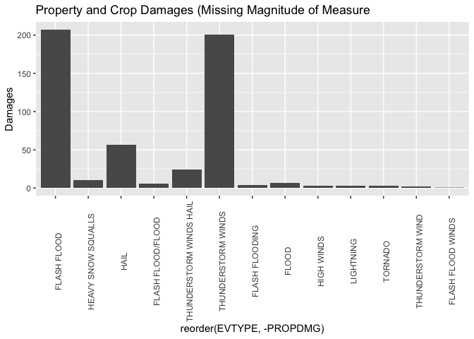
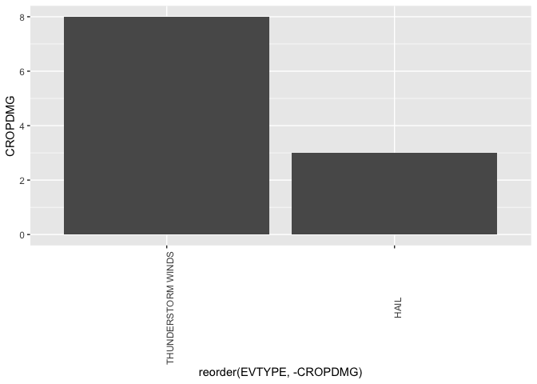
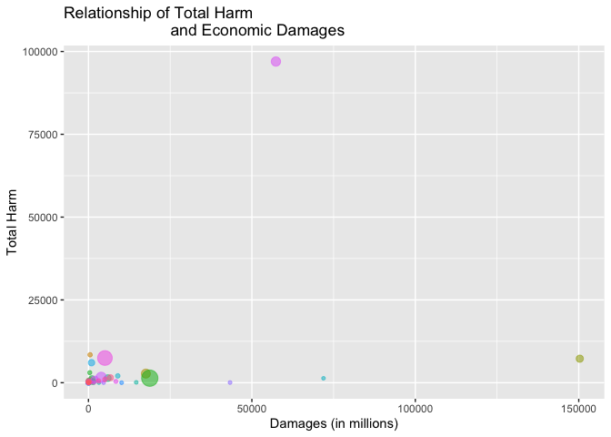

National Climatic Data Center Storm Events Analysis
================

## Introduction

Storms and other severe weather events can cause both public health and
economic problems for communities and municipalities. Many severe events
can result in fatalities, injuries, and property damage, and preventing
such outcomes to the extent possible is a key concern.

This project involves exploring the U.S. National Oceanic and
Atmospheric Administration’s (NOAA) storm database. This database tracks
characteristics of major storms and weather events in the United States,
including when and where they occur, as well as estimates of any
fatalities, injuries, and property damage.

## Data

The data for this assignment come in the form of a comma-separated-value
file compressed via the bzip2 algorithm to reduce its size. You can
download the file from the course web site:

  - [Storm
    Data](https://d396qusza40orc.cloudfront.net/repdata%2Fdata%2FStormData.csv.bz2)

There is also some documentation of the database available. Here you
will find how some of the variables are constructed/defined.

  - National Weather Service [Storm Data
    Documentation](https://d396qusza40orc.cloudfront.net/repdata%2Fpeer2_doc%2Fpd01016005curr.pdf)
  - National Climatic Data Center Storm Events
    [FAQ](https://d396qusza40orc.cloudfront.net/repdata%2Fpeer2_doc%2FNCDC%20Storm%20Events-FAQ%20Page.pdf)

## Environment Setup

``` r
library(tidyverse)
library(plotly)
library(cowplot)
library(lubridate)
downloadDate <- date()
sessionInfo()
```

    ## R version 3.6.3 (2020-02-29)
    ## Platform: x86_64-apple-darwin15.6.0 (64-bit)
    ## Running under: macOS Catalina 10.15.4
    ## 
    ## Matrix products: default
    ## BLAS:   /Library/Frameworks/R.framework/Versions/3.6/Resources/lib/libRblas.0.dylib
    ## LAPACK: /Library/Frameworks/R.framework/Versions/3.6/Resources/lib/libRlapack.dylib
    ## 
    ## locale:
    ## [1] en_US.UTF-8/en_US.UTF-8/en_US.UTF-8/C/en_US.UTF-8/en_US.UTF-8
    ## 
    ## attached base packages:
    ## [1] stats     graphics  grDevices utils     datasets  methods   base     
    ## 
    ## other attached packages:
    ##  [1] lubridate_1.7.8 cowplot_1.0.0   plotly_4.9.2.1  forcats_0.5.0  
    ##  [5] stringr_1.4.0   dplyr_0.8.5     purrr_0.3.4     readr_1.3.1    
    ##  [9] tidyr_1.0.2     tibble_3.0.1    ggplot2_3.3.0   tidyverse_1.3.0
    ## 
    ## loaded via a namespace (and not attached):
    ##  [1] tidyselect_1.0.0  xfun_0.12         haven_2.2.0       lattice_0.20-40  
    ##  [5] colorspace_1.4-1  vctrs_0.2.4       generics_0.0.2    viridisLite_0.3.0
    ##  [9] htmltools_0.4.0   yaml_2.2.1        rlang_0.4.5       pillar_1.4.3     
    ## [13] glue_1.4.0        withr_2.2.0       DBI_1.1.0         dbplyr_1.4.2     
    ## [17] modelr_0.1.6      readxl_1.3.1      lifecycle_0.2.0   munsell_0.5.0    
    ## [21] gtable_0.3.0      cellranger_1.1.0  rvest_0.3.5       htmlwidgets_1.5.1
    ## [25] evaluate_0.14     knitr_1.28        fansi_0.4.1       broom_0.5.5      
    ## [29] Rcpp_1.0.4        scales_1.1.0      backports_1.1.6   jsonlite_1.6.1   
    ## [33] fs_1.3.2          hms_0.5.3         digest_0.6.25     stringi_1.4.6    
    ## [37] grid_3.6.3        cli_2.0.2         tools_3.6.3       magrittr_1.5     
    ## [41] lazyeval_0.2.2    crayon_1.3.4      pkgconfig_2.0.3   ellipsis_0.3.0   
    ## [45] data.table_1.12.8 xml2_1.3.1        reprex_0.3.0      assertthat_0.2.1 
    ## [49] rmarkdown_2.1     httr_1.4.1        rstudioapi_0.11   R6_2.4.1         
    ## [53] nlme_3.1-145      compiler_3.6.3

## Data Processing

Download date is Fri Apr 24 23:05:31 2020.

``` r
fileUrl <-
        "https://d396qusza40orc.cloudfront.net/repdata%2Fdata%2FStormData.csv.bz2"
fname <- c("./data/maindf.csv.bz2")

if (!file.exists("data")) {
        dir.create("data")
}

download.file(fileUrl, destfile = "./data/maindf.csv.bz2", method = "curl")

maindf <-
        read.csv(
                fname,
                header = TRUE,
                na.strings = c("", "NA"),
                stringsAsFactors = FALSE
        )
```

## Purpose

The basic goal of this assignment is to explore the NOAA Storm Database
and answer some basic questions about severe weather events. You must
use the database to answer the questions below and show the code for
your entire analysis. Your analysis can consist of tables, figures, or
other summaries. You may use any R package you want to support your
analysis.

Data analysis must address the following questions:

1.  Across the United States, which types of **events** (as indicated in
    the EVTYPE variable) are most **harmful** with respect to population
    health?

2.  Across the United States, which types of **events** have the
    greatest **economic consequences**?

## Strategy in Dimension Reduction

1.  Focus on the **Purpose**
2.  Analyze missing data
      - Event Type
      - Harmful to health
      - Economic consequences
3.  Imputing missing data
4.  Analyze the data

note: using ggplot2 combined with plotly, some charts **interactive
charts (zoom in please)**.

### Focus on the Purpose

Select only the data needed to answer the question.

``` r
noaadf<- maindf %>% select(EVTYPE, PROPDMG, PROPDMGEXP, CROPDMG, CROPDMGEXP, FATALITIES, INJURIES)
```

### Analyze missing data

``` r
naAnalysis <- noaadf %>%
    purrr::map_df(function(x) round(mean(is.na(x)),digits = 2)*100) %>%
    gather(EVType, naAverage)

naAnalysis %>% ggplot(aes(x = EVType, y = naAverage)) %>% +
  geom_point(aes(reorder(EVType, naAverage))) + theme(axis.text.x =
              element_text(angle = 90, hjust = .1)) + labs(x = "Event Type", 
              y = "NA Average  (%)", title = "Missing Data Analysis")
```

<!-- -->

### Magnitude of Measure (K,M,B)

Property damages are divided into 2 variables which are:

1.  PROPDMG - 0 missing data
2.  PROPDMGEXP (Magnitude of measure) - 52 % missing data

Crop damages are divided into 2 variables which are:

1.  CROPDMG - 0 missing data
2.  CROPDMGEXP (Magnitude of measure) - 69 % missing data

Next step is to dig deeper and see what is behind our 52% missing data
in PROPDMGEXP and 69% missing data in CROPDMGEXP.

According to [Storm Data
Documentation](https://d396qusza40orc.cloudfront.net/repdata%2Fpeer2_doc%2Fpd01016005curr.pdf)
(page 12) the magnitude of the PROPDMG and CROPDMG are as follows: K=
10^3, M= 10^6, B=10^9

Deep dive the values of NA (missing data) in PROPDMGEXP and CROPDMGEXP.

``` r
RgPropEXP <- table(unlist(noaadf$PROPDMGEXP)) 

RgPropEXPdf <-
        tibble(Magnitude = names(RgPropEXP), FREQ = as.integer(RgPropEXP))

RgCropEXP <- table(unlist(noaadf$CROPDMGEXP))
RgCropEXPdf <-
        tibble(Magnitude = names(RgCropEXP), FREQ = as.integer(RgCropEXP))

RgCropEXPdf$Event <- "Crop"
RgPropEXPdf$Event <- "Prop"

PC <- rbind(RgPropEXPdf, RgCropEXPdf)

g1<- 
        PC %>% ggplot(aes(
                x = reorder(Magnitude, -FREQ), y = FREQ, fill = Event
        )) + geom_col() + labs(x = "Magnitude of Measure (K, M, B)", y = "Frequency", title = "Frequency of Magnitude of Measure",subtitle = "(without log10)")+ theme(legend.position = "none"
)
gg1<- 
        PC %>% ggplot(aes(
                x = reorder(Magnitude, -FREQ), y = FREQ, fill = Event
        )) + geom_col() + labs(x = "Magnitude of Measure (K, M, B)", y = "Frequency (log10)", title = "Frequency of Magnitude of Measure",subtitle = "(log10)")+scale_y_log10()
plot_grid(g1, gg1) 
```

<!-- -->

``` r
PC %>% arrange(desc(FREQ))
```

    ## # A tibble: 26 x 3
    ##    Magnitude   FREQ Event
    ##    <chr>      <int> <chr>
    ##  1 K         424665 Prop 
    ##  2 K         281832 Crop 
    ##  3 M          11330 Prop 
    ##  4 M           1994 Crop 
    ##  5 0            216 Prop 
    ##  6 B             40 Prop 
    ##  7 5             28 Prop 
    ##  8 1             25 Prop 
    ##  9 k             21 Crop 
    ## 10 0             19 Crop 
    ## # … with 16 more rows

``` r
na_prop <- noaadf %>% filter(is.na(PROPDMGEXP), PROPDMG > 0)
na_crop <- noaadf %>% filter(is.na(CROPDMGEXP), CROPDMG > 0)
g2 <-
        na_prop %>% ggplot(aes(x = reorder(EVTYPE, -PROPDMG), y = PROPDMG)) + geom_col() +
        theme(axis.text.x = element_text(angle = 90, hjust = .5)) + labs(y =
                                                                                 "Damages", title = "Property and Crop Damages (Missing Magnitude of Measure")
gg2 <-
        na_crop %>% ggplot(aes(x = reorder(EVTYPE, -CROPDMG), y = CROPDMG)) + geom_col() +
        theme(axis.text.x = element_text(angle = 90, hjust = .5))

# subplot(g2, gg2, shareY = T) for interactive charts 
```

``` r
g2
```

<!-- -->

``` r
gg2
```

<!-- -->

``` r
plen<-length(na_prop$PROPDMG)
psum<-sum(na_prop$PROPDMG)

clen<-length(na_crop$CROPDMG)
csum<-sum(na_crop$CROPDMG)
```

### Findings and Recommendations

According to [Storm Data
Documentation](https://d396qusza40orc.cloudfront.net/repdata%2Fpeer2_doc%2Fpd01016005curr.pdf)
(page 12) the magnitude of the PROPDMG and CROPDMG are as follows: K=
10^3, M= 10^6, B=10^9

Property Damage with missing magnitude **Findings**:

1.  PROPDMGEXP has 76 unique observations, K has the most frequency
2.  PROPDMGEXP has 52% missing data
3.  Out of the 52% missing data there are 76 observations valuing total
    property damage of 527.41

PROPDMGEXP **Recommendation**:

1.  Use the magnitude recommended by the Storm Data Documentation (K, M,
    B) plus O =10^0
2.  Data base manager needs to address this issue and convert CROPDMGEXP
    to O=10^0, K= 10^3, M= 10^6, and B=10^9.
3.  Person that completes the data entry should only have a choice of O,
    K, M, B, as a unit of measure

Crop Damage with missing magnitude **Findings**:

1.  CROPDMGEXP has 3 unique observations, K has the most frequency
2.  CROPDMGEXP has 69% missing data
3.  Out of the 69% missing data there are 3 observations valuing total
    property damage of 11

CROPDMGEXP **Recommendation**:

1.  Use the magnitude recommended by the Storm Data Documentation (K, M,
    B) plus O =10^0
2.  Data base manager needs to address this issue and convert CROPDMGEXP
    to O=10^0, K= 10^3, M= 10^6, and B=10^9.
3.  Person that completes the data entry should only have a choice of O,
    K, M, B, as a unit of measure

The value of damages 527.41 and 11 has no magnitude and needs to be
excluded from our analysis. We cannot tell if it is valued at 1000, a
million or a billion.

### Continue Reducing the Dimension

With the knowledge we gained from analyzing the missing data, we will
convert magnitude as follows:

1.  H/h = 10^2
2.  K/k = 10^3
3.  M/m = 10^6
4.  B/b = 10^9
5.  anything other than these will be at 0 (filter them out)

<!-- end list -->

``` r
PC %>% arrange(desc(FREQ))
```

    ## # A tibble: 26 x 3
    ##    Magnitude   FREQ Event
    ##    <chr>      <int> <chr>
    ##  1 K         424665 Prop 
    ##  2 K         281832 Crop 
    ##  3 M          11330 Prop 
    ##  4 M           1994 Crop 
    ##  5 0            216 Prop 
    ##  6 B             40 Prop 
    ##  7 5             28 Prop 
    ##  8 1             25 Prop 
    ##  9 k             21 Crop 
    ## 10 0             19 Crop 
    ## # … with 16 more rows

``` r
unique(noaadf$PROPDMGEXP)
```

    ##  [1] "K" "M" NA  "B" "m" "+" "0" "5" "6" "?" "4" "2" "3" "h" "7" "H" "-" "1" "8"

``` r
unique(noaadf$CROPDMGEXP)
```

    ## [1] NA  "M" "K" "m" "B" "?" "0" "k" "2"

``` r
# recode the data K=10^3...
noaadf$PROPDMGEXP <-
        recode(
                noaadf$PROPDMGEXP,
                "K" = 10 ^ 3,
                "M" = 10 ^ 6,
                "B" = 10 ^ 9,
                "m" = 10 ^ 6,
                "+" = 0,
                "5" = 0,
                "6" = 0,
                "?" = 0,
                "4" = 0,
                "2" = 0,
                "3" = 0,
                "h" = 10 ^ 2,
                "7" = 0,
                "H" = 10 ^ 2,
                "-" = 0,
                "8" = 0,
                .default = 1
        )
noaadf$PROPDMGEXP[is.na(noaadf$PROPDMGEXP)] <- 0
sum(is.na(noaadf$PROPDMGEXP))
```

    ## [1] 0

``` r
noaadf$CROPDMGEXP <-
        recode(
                noaadf$CROPDMGEXP,
                "M" = 10 ^ 6,
                "K" = 10 ^ 3,
                "m" = 10 ^ 6,
                "B" = 10 ^ 9,
                "?" = 0,
                "k" = 10 ^ 3,
                "2" = 0,
                .default = 1
        )
noaadf$CROPDMGEXP[is.na(noaadf$CROPDMGEXP)] <- 0
sum(is.na(noaadf$CROPDMGEXP))
```

    ## [1] 0

``` r
# multiply Damage with Magnitude
noaadf <-
        noaadf %>% mutate(Property_Damage = PROPDMG * PROPDMGEXP,
                          Crop_Damages = CROPDMG * CROPDMGEXP)

# select only needed
noaadf <-
        noaadf %>% select(EVTYPE, FATALITIES, INJURIES, Property_Damage, Crop_Damages)

noaadf <- noaadf %>% mutate(Damages = Property_Damage + Crop_Damages)
noaadf <- noaadf %>% select(EVTYPE, FATALITIES, INJURIES, Damages)
```

``` r
TotalDmg<- sum(noaadf$Damages)/10^6
TotalDth<-sum(noaadf$FATALITIES)
TotalInj<-sum(noaadf$INJURIES)

noaadf$EVTYPE <- factor(noaadf$EVTYPE)
by_event <- group_by(noaadf, EVTYPE)
```

## Results - finally

Too many days and nights were spent analyzing and over thinking this
assignment. FOCUS\!

``` r
sumFinalDf <- summarise(
        by_event,
        count = n(),
        Fatalities = sum(FATALITIES),
        rankFtly = min_rank(desc(Fatalities)),
        Injuries = sum(INJURIES),
        rankInj = min_rank(Injuries),
        Dmg = sum(Damages),
        rankDmg = min_rank(desc(Dmg))
)
takealook <- sumFinalDf %>% filter(Fatalities > 0 & Dmg > 0)

g3 <-
        takealook %>% ggplot(aes(
                x = Dmg / 10 ^ 6,
                y = Fatalities + Injuries,
                color = EVTYPE,
                alpha = .3
        )) + geom_point(aes(size = count)) + labs(x = "Damages (in millions)", 
                        y ="Total Harm", 
                        title = "Relationship of Total Harm 
                        and Economic Damages") +
                        theme(legend.position = "none")

g3
```

<!-- -->

``` r
# ggplotly(g3) %>% hide_legend() for interactive charts
```

1.  Across the United States, which types of **events** (as indicated in
    the EVTYPE variable) are most **harmful** with respect to population
    health?

<!-- end list -->

  - From 1950 to 2011, tornado has the most harmful of all events.
    **Zoom in above the chart** to remove the outliers of the data.

<!-- end list -->

2.  Across the United States, which types of **events** have the
    greatest **economic consequences**?

<!-- end list -->

  - From 1950-2011, flood has the greatest economic consequences across
    the United States.
